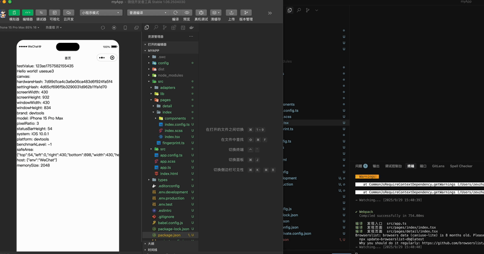

# Taro Code Inspector

[](https://www.npmjs.com/package/taro-code-inspector)
[](https://opensource.org/licenses/MIT)
[](https://nodejs.org/)

> 一个强大的 Taro 开发工具，支持点击组件直接跳转到源码，提升开发效率

## ✨ 功能特性

- 🎯 **点击跳转源码** - 在开发环境中点击任意组件即可跳转到对应的源码位置
- 🔧 **多编辑器支持** - 支持 VSCode、WebStorm、Sublime Text 等主流编辑器
- 📱 **全组件覆盖** - 支持所有 Taro 内置组件和自定义组件
- ⚡ **零配置使用** - 开箱即用，无需复杂配置
- 🚀 **开发环境专用** - 仅在开发环境中生效，不影响生产构建

## 🎬 演示视频



## 📦 安装

```bash
npm install taro-code-inspector --save-dev
```

或使用 yarn：

```bash
yarn add taro-code-inspector --dev
```

## 🚀 快速开始

### 1. 配置 Taro 插件

在项目根目录的 `config/dev.js` 文件中添加插件：

```javascript
const config = {
  plugins: ["taro-code-inspector"],
};

module.exports = config;
```

### 2. 配置 Babel 插件

在 `babel.config.js` 中添加 Babel 插件：

```javascript
module.exports = {
  plugins: [
    // 仅在开发环境中启用
    ...(process.env.NODE_ENV === "development"
      ? ["taro-code-inspector/dist/bable-inject-path"]
      : []),
  ],
};
```

### 3. 在应用中启用

在 `app.js` 中导入并启用：

```javascript
import openCodePageProxy from "taro-code-inspector/dist/devPageProxy";

if (process.env.NODE_ENV === "development") {
  openCodePageProxy();
}
```

### 4. 添加样式（可选）

在 `app.css` 中添加点击高亮样式：

```css
.global_open_code_hover {
  background-color: rgba(21, 179, 223, 0.576);
}
```

## 🛠️ 开发

### 构建项目

```bash
npm run build
```

### 开发模式

```bash
npm run dev
```

## 🤝 贡献

我们欢迎所有形式的贡献！请查看 [贡献指南](CONTRIBUTING.md) 了解如何参与项目开发。

### 贡献方式

1. Fork 本仓库
2. 创建特性分支 (`git checkout -b feature/AmazingFeature`)
3. 提交更改 (`git commit -m 'Add some AmazingFeature'`)
4. 推送到分支 (`git push origin feature/AmazingFeature`)
5. 开启 Pull Request

## 📄 许可证

本项目基于 [MIT 许可证](LICENSE) 开源。

## 🐛 问题反馈

如果您遇到任何问题或有功能建议，请：

1. 查看 [常见问题](https://github.com/zev-zhao/taro-code-inspector/issues)
2. 创建 [Issue](https://github.com/zev-zhao/taro-code-inspector/issues/new)
3. 联系维护者

## 📈 更新日志

查看 [CHANGELOG.md](CHANGELOG.md) 了解版本更新历史。

## ⭐ Star History

如果这个项目对您有帮助，请给我们一个 ⭐！

---

**注意**: 此工具仅在开发环境中使用，不会影响生产构建的性能和大小。
